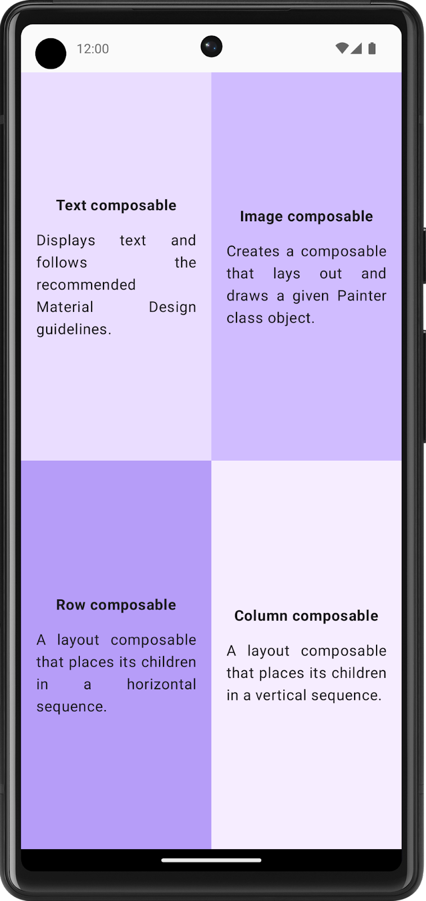

# Compose_Quadrant
 an app that displays the information about the Composable functions that you learned.

The screen is divided into four quadrants. Each quadrant provides the name of a Composable function and describes it in one sentence.

